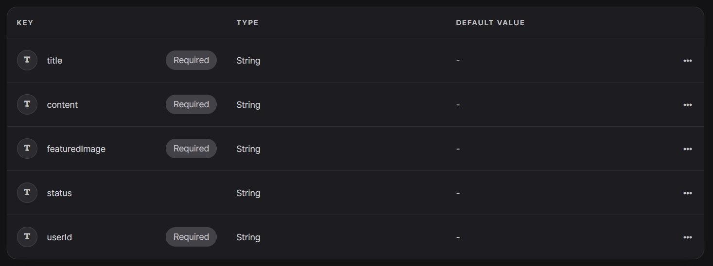

# Mega Project : Blog Website 
Tech Stack Used :
- Frontend : HTML, CSS, JS, React
- Backend : [appWrite](https://appwrite.io/)
- For Text Editor : [tinyMCE](https://www.tiny.cloud/)
- For Forms : [React-hook-form](https://react-hook-form.com/)
- [html-react-parser](https://www.npmjs.com/package/html-react-parser)

## Step 1 : Project Setup and Setting up Environment Varibales
Steps Involved : 
1. Create Vite App ✅<br>
  ```
  npm create vite@latest
  ```
2. Install dependencies ✅
   
   1. Install Redux Toolkit<br>

      ```
        npm install @reduxjs/toolkit react-redux
      ```
      
   3. Install React Redux<br>

       ```
        npm install react-redux
      ```
      
   5. Install React Router Dom<br>

       ```
        npm install react-router-dom
      ```
      
   7. Install appwrite<br>

       ```
        npm install appwrite 
      ```
      
   9. Install tinyMCE<br>

       ```
        npm install tinymce
      ```
       
   11. install html-react-parser<br>

       ```
        npm install html-react-parse
        ```
        
   13. Install React hook form<br>
        ```
        npm install react-hook-form
        ```
       
3. Test Server ✅<br>
 
```
  npm run dev
```

4. Setup Environment Variables ✅(.env file)

  

5. git ignore for .env file
6. Initialize  Environment Variables (appWrite)
    1. Create Project<br>        
    2. Create DataBase<br>     
    3. Create Collection<br>
    4. Create Attributes (title, content, featuredImage, status, userID)<br>
    5. Create Index (status)<br>   
    6. Create Bucket / Storage (Images)<br>

  
         
7. Configure Environment Varibales
