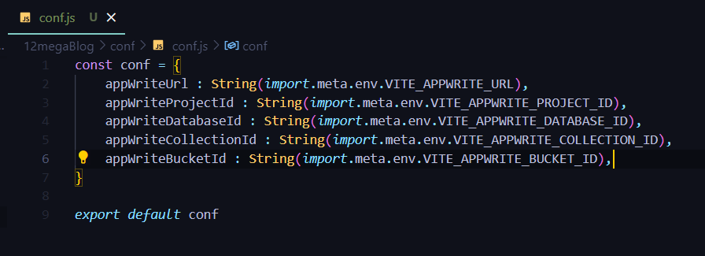

# React
This is a tutorial on React JS. 

[Documentation](https://react.dev/)

## 1. Getting Started

- Same as npm, we have npx to execute node files.
- To create a react app, we can use npx

```
npx create-react-app appName
```
This might ask you something like this :


Now, Here in package.json

```json
{
  "name": "01basicreact",
  "version": "0.1.0",
  "private": true,
  "dependencies": {
    "@testing-library/jest-dom": "^5.17.0",
    "@testing-library/react": "^13.4.0",
    "@testing-library/user-event": "^13.5.0",
    "react": "^18.2.0",
    "react-dom": "^18.2.0",
    "react-scripts": "5.0.1",
    "web-vitals": "^2.1.4"
  },
  "scripts": {
    "start": "react-scripts start",
    "build": "react-scripts build",
    "test": "react-scripts test",
    "eject": "react-scripts eject"
  },
  "eslintConfig": {
    "extends": [
      "react-app",
      "react-app/jest"
    ]
  },
  "browserslist": {
    "production": [
      ">0.2%",
      "not dead",
      "not op_mini all"
    ],
    "development": [
      "last 1 chrome version",
      "last 1 firefox version",
      "last 1 safari version"
    ]
  }
}

```

when we see the script property, we can see there is a start property to start the react app.

``` 
npm run start
```


- But this is a very slow process (it takes too much time to create react app)
- Hence, we use [Vite](https://vitejs.dev/), which is a package bundler to use react.

```
npm create vite@latest
```
This might ask you to install vite : 

 

press y and proceed further



Now, Enter the Project Name and Select a Framework (i.e React) and also which variant of JS, we are going to use here.


This will create a react app,


Now, we can see this folder doesn't has node_modules folder. To install it first we need to go inside the project file. 

``` 
cd 01vitereact
npm install
```

Now, since we have node_modules folder, we can easily run our app.

So, lets check what all properties we have in our package.json.

```json
{
  "name": "01vitereact",
  "private": true,
  "version": "0.0.0",
  "type": "module",
  "scripts": {
    "dev": "vite",
    "build": "vite build",
    "lint": "eslint . --ext js,jsx --report-unused-disable-directives --max-warnings 0",
    "preview": "vite preview"
  },
  "dependencies": {
    "react": "^18.2.0",
    "react-dom": "^18.2.0"
  },
  "devDependencies": {
    "@types/react": "^18.2.66",
    "@types/react-dom": "^18.2.22",
    "@vitejs/plugin-react": "^4.2.1",
    "eslint": "^8.57.0",
    "eslint-plugin-react": "^7.34.1",
    "eslint-plugin-react-hooks": "^4.6.0",
    "eslint-plugin-react-refresh": "^0.4.6",
    "vite": "^5.2.0"
  }
}
```

Here, in the scripts we have several methods which are used to do some specific tasks like run, build, preview, etc our react app.

Now, to run : 

```
npm run dev
```


@https://localhost:5173


