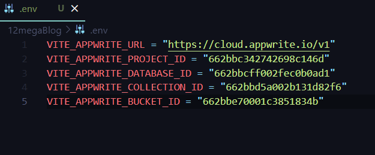

# Mega Project : Blog Website 
Tech Stack Used :
- Frontend : HTML, CSS, JS, React
- Backend : [appWrite](https://appwrite.io/)
- For Text Editor : [tinyMCE](https://www.tiny.cloud/)
- For Forms : [React-hook-form](https://react-hook-form.com/)
- [html-react-parser](https://www.npmjs.com/package/html-react-parser)

## Step 1 : Project Setup and Setting up Environment Varibales
Steps Involved : 
1. Create Vite App ✅<br>
  ```
  npm create vite@latest
  ```
2. Install dependencies ✅
   
   1. Install Redux Toolkit<br>

      ```
        npm install @reduxjs/toolkit react-redux
      ```
      
   3. Install React Redux<br>

       ```
        npm install react-redux
      ```
      
   5. Install React Router Dom<br>

       ```
        npm install react-router-dom
      ```
      
   7. Install appwrite<br>

       ```
        npm install appwrite 
      ```
      
   9. Install tinyMCE<br>

       ```
        npm install tinymce
      ```
       
   11. install html-react-parser<br>

       ```
        npm install html-react-parse
        ```
        
   13. Install React hook form<br>
        ```
        npm install react-hook-form
        ```
    14. Install Tailwind and [Configure](https://tailwindcss.com/docs/guides/vite) <br>
        ```
        npm install -D tailwindcss postcss autoprefixer
        npx tailwindcss init -p
        ```
        
       
3. Test Server ✅<br>
 
```
  npm run dev
```

4. Setup Environment Variables ✅(.env file)

5. git ignore for .env file ✅
6. Initialize  Environment Variables (appWrite) ✅
    1. Create Project        
    2. Create DataBase     
    3. Create Collection
    4. Create Attributes (title, content, featuredImage, status, userID)

      

    5. Create Index (status)   
    6. Create Bucket / Storage (Images)

  
         
7. Configure Environment Varibales ✅

  

## Step 2 : Setting up Authentication Service using Appwrite

1. Create a Service (AuthService : It is a Class), in a file auth.js ✅
2. Define Constructor Mehtod ✅
3. Define all other Mehods for : (SignUp, Login, Logout and getCurrentUser) ✅

For Better Practices, we use try catch in all these methods so that we can easily handle errors.

Here is documentation on How to use [Appwrite for Authentication](https://appwrite.io/docs/products/auth/accounts)

## Step 3 : Configuration, creating Services to Manage Databases, File Upload or Delete and Queries

1. Create Config.js service ✅
2. Create Constructor Mehod and Initialize variables ✅
3. Post Related Services : [Database Docs](https://appwrite.io/docs/references/cloud/client-web/databases)
  1. createPost Method : Create a Document ( taking slug as id ) ✅
  2. updatePost Method : Update the Document ( No need to pass UserID, as only the owner can use this method) ✅
  3. deletePost Method  : Deletes the Document ✅
  4. getPost Method : On Clicking a Particular Post, that post opens up. ✅
  5. getPosts Method : All the posts available on the feed. [Query Docs](https://appwrite.io/docs/products/databases/queries) ✅
    _[Here, We got to know how to pass Queries, and what Other parameters we can give in this method ( i.e Pagination , Number of Results, etc)]_
4. File Upload Services : [Storage Docs](https://appwrite.io/docs/references/cloud/client-web/storage)
  1. uploadFile Method : Upload the File to the Storage (or Bucket) ✅
  2. deleteFile Method : Delete the File Using the fileId provided during uploadFile() ✅
  3. getFilePreview Method : Previews the File, It is fast and hence We don't need to use async - await here. ✅


## Step 4 : Configuration of  Redux Toolkit

1. Setting up a store using Redux toolkit : (store.js, configureStore({}))✅
2. Creating and configuring redux store and authentication slice (authSlice.js, createSlice({name, initialState, reducers : {//actions(methods)}}), authSlice.reducers, authSlice.actions) ✅
3. Configuring Redux Toolkit for managing state and actions in big projects (state, action, action.payload)✅

## Step 5 : Creating Header and Footer Components 

Create Components ✅

## Step 6 : Configuring Redux Toolkit Methods for login and logout in App.jsx

1. setLoader ✅
2. getCurrentUser and dispatch() ✅
3. change Loader value ✅
4. Conditional Rendering ✅

## Step 7 : Create All Components : Understanding React components for form validation

1. Container : set css : "w-full max-w-7xl mx-auto px-4" ✅
2. Updating Footer Component ✅
3. Create Logo Component : props : width = '100px' ✅
4. Create LogoutBtn Component in Header 
    1. Add Functionality to LogoutBtn : Create a dispatch and a logout handler ✅
    2. Add css : 'inline-block px-6 py-2 duration-200 hover:bg-blue-100 rounded-full' ✅
5. update Header Component : 
    1. useSelector : to get status ✅
    2. useNavigate ✅
    3. navItems array of objects containing name and slug and active : Home, Login, Signup, All Posts, Add Post
     [Create a navigation bar with a logo, Adding navigation with React Router] ✅
    4. CSS : py-3 shadow bg-gray-500 ✅
    5. Nav Item Button CSS : 'inline-block py-6 py-2 duration-200 hover:bg-blue-100 rounded-full' ✅
    6. Add Logout Button ✅
6. Create Button Componenet 
    1. Props : children, type, bgColor, textColor, className, ...props ✅
    2. React components can be referred to as children or text
7. Create Input Component
    1. forwardRef(fn, ref) ✅
    2. props : label, type = "text", className = " ", ...props ✅
    3. CSS : className = "w-full" ✅
    4. Creating unique IDs for accessibility purpose ✅
8. Importing components in React using index file ✅


